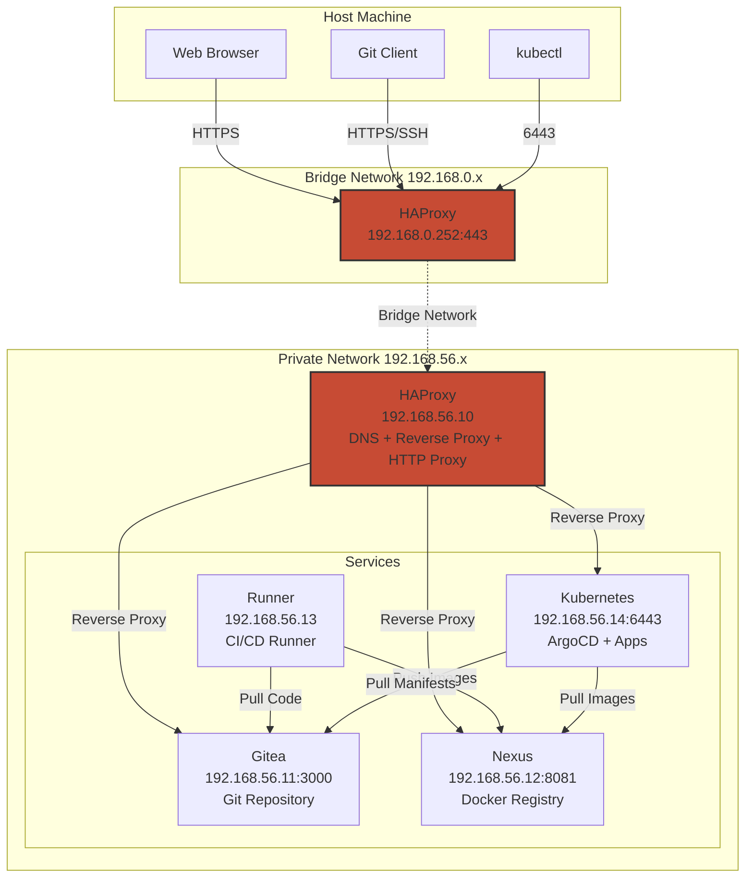
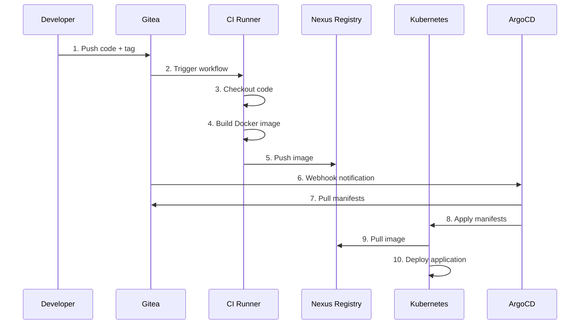

# DevOps CI/CD Infrastructure

This project provides a complete, self-contained CI/CD infrastructure using Vagrant and VirtualBox. It includes Git hosting (Gitea), artifact management (Nexus), continuous deployment (ArgoCD), CI runners, and a Kubernetes cluster for deploying applications.

## Architecture Overview



## Network Architecture

### Bridge Network (192.168.0.x)
- **Purpose**: Allows access from your host machine to the infrastructure
- **HAProxy**: Acts as the entry point on `192.168.0.252`
- **Access**: HTTPS (443), HTTP Proxy (3128), SSH (2222), Kubernetes API (6443)

### Private Network (192.168.56.x)
- **Purpose**: Internal communication between VMs
- **Isolation**: VMs communicate securely within this network
- **DNS**: HAProxy provides DNS resolution for `*.devops.active` domains

## Infrastructure Components

### 1. HAProxy VM (192.168.56.10)
**Role**: Central gateway and service mesh

- **DNS Server**: Resolves `*.devops.active` domains to internal IPs
- **Reverse Proxy**: Routes HTTPS traffic to internal services
  - `gitea.devops.active` → Gitea (192.168.56.11:3000)
  - `nexus.devops.active` → Nexus (192.168.56.12:8081)
  - `argocd.devops.active` → ArgoCD on Kubernetes (192.168.56.14:30080)
  - `k8s.devops.active` → Kubernetes API (192.168.56.14:6443)
- **HTTP Proxy**: Squid proxy on port 3128 for outbound HTTP/HTTPS
- **SSL/TLS**: Self-signed CA certificate for all services
- **SSH Gateway**: Forwards SSH traffic to Gitea (port 2222)

### 2. Gitea VM (192.168.56.11)
**Role**: Git repository hosting and CI/CD orchestration

- **Git Server**: Hosts repositories with web UI
- **Gitea Actions**: Built-in CI/CD engine (GitHub Actions compatible)
- **Runner Coordination**: Dispatches jobs to the Runner VM
- **Features**:
  - User management and authentication
  - Repository management
  - Webhook support for ArgoCD
  - SSH and HTTPS access

### 3. Nexus VM (192.168.56.12)
**Role**: Artifact repository and Docker registry

- **Docker Registry**: Path-based routing at `/repository/docker-hosted/`
- **Artifact Storage**: Maven, npm, PyPI, and other package formats
- **User Management**:
  - `docker-reader`: Read-only access for pulling images
  - `docker-writer`: Write access for CI/CD pipelines
- **Integration**: Used by Runner for pushing images, Kubernetes for pulling images

### 4. Runner VM (192.168.56.13)
**Role**: CI/CD job execution

- **Gitea Actions Runner**: Executes CI/CD workflows
- **Docker-in-Docker**: Runs build jobs in isolated containers
- **Label Support**:
  - `ubuntu-latest`: Standard Ubuntu runner
  - `cdrunner`: Custom image with additional tools
- **Capabilities**:
  - Build Docker images
  - Run tests
  - Push artifacts to Nexus
  - Deploy to Kubernetes
- **Security**: Mounts CA certificates for trusting self-signed certificates

### 5. Kubernetes VM (192.168.56.14)
**Role**: Container orchestration and continuous deployment

- **Kind Cluster**: Kubernetes in Docker for development
- **ArgoCD**: GitOps continuous deployment
- **Ingress Controller**: Routes traffic to applications
- **Features**:
  - Automatic deployment from Git repositories
  - Image pull secrets for Nexus registry
  - ConfigMaps and Secrets management
  - Service mesh capabilities

## CI/CD Workflow



### Workflow Steps Explained

1. **Code Push**: Developer pushes code and creates a Git tag
2. **Trigger**: Gitea Actions detects the push and triggers the workflow
3. **Checkout**: Runner clones the repository
4. **Build**: Docker image is built using buildx
5. **Push**: Image is pushed to Nexus Docker registry
6. **Sync**: ArgoCD detects changes via webhook or polling
7. **Pull Manifests**: ArgoCD fetches Kubernetes manifests from Git
8. **Apply**: ArgoCD applies manifests to Kubernetes
9. **Pull Image**: Kubernetes pulls the image from Nexus
10. **Deploy**: Application is deployed and running

## Security Features

### TLS/SSL
- Self-signed CA certificate for all services
- Certificate mounted into containers for Docker operations
- Path-based Docker registry configuration at `/etc/docker/certs.d/nexus.devops.active/`

### Network Isolation
- Private network for inter-VM communication
- HAProxy as single entry point with reverse proxy
- No direct access to internal services from host

### Authentication
- Gitea: User accounts with SSH keys
- Nexus: Role-based access (read-only, write)
- Kubernetes: ServiceAccount tokens and RBAC
- ArgoCD: SSO and RBAC support

## Resource Allocation

| VM | vCPUs | RAM | Disk | Purpose |
|---|---|---|---|---|
| HAProxy | 1 | 1 GB | Diff | Gateway & Proxy |
| Gitea | 2 | 2 GB | Diff | Git Server |
| Nexus | 2 | 4 GB | Diff | Artifact Storage |
| Runner | 2 | 2 GB | Diff | CI/CD Execution |
| Kubernetes | 2 | 2 GB | Diff | Container Orchestration |
| **Total** | **9** | **11 GB** | **~15 GB** | Full Stack |

*Note: Using linked clones reduces disk usage significantly*

## Setup

### Prerequisites

Download and install:
  * [Vagrant](https://developer.hashicorp.com/vagrant/install)
  * [VirtualBox](https://www.virtualbox.org/wiki/Downloads)
  * [Kubectl](https://dl.k8s.io/release/v1.35.0/bin/windows/amd64/kubectl.exe) and save in any `$env:Path` folder
  * [Ansible](https://docs.ansible.com/ansible/latest/installation_guide/intro_installation.html) - Required for automated provisioning

**Installing Ansible:**
```bash
# Ubuntu/Debian
sudo apt-get update && sudo apt-get install -y ansible

# macOS
brew install ansible

# Windows (via WSL2)
# Install WSL2 first, then install Ansible inside Ubuntu/Debian WSL
```

Optional but recommended:
```powershell
### DNS Configuration

Configure your host machine to use HAProxy as DNS server for `*.devops.active` domains:

**Option 1: System-wide (Windows)**
1. Open Network Settings
2. Set DNS server to `192.168.0.252` (HAProxy bridge IP)

**Option 2: Hosts file**
Add these entries to `C:\Windows\System32\drivers\etc\hosts`:
```
192.168.0.252 gitea.devops.active
192.168.0.252 nexus.devops.active
192.168.0.252 argocd.devops.active
192.168.0.252 k8s.devops.active
```

### Certificate Installation

Import the self-signed CA certificate to your local Root store:
### Initial Deployment

The infrastructure uses **Ansible for DNS provisioning** and shell scripts for application services.

Start all VMs:
```powershell
vagrant up
```

This will:
1. Create 5 VMs (haproxy, gitea, nexus, runner, kube)
2. Run Ansible playbooks for DNS server/client setup
3. Run shell scripts for application provisioning

**Time**: Initial setup takes ~15-20 minutes depending on your machine.

For more details on Ansible provisioning, see [VAGRANT_ANSIBLE.md](VAGRANT_ANSIBLE.md).

#### Re-provision DNS Only

To re-run only the Ansible DNS provisioning:
```bash
# All VMs
vagrant provision --provision-with ansible

# Specific VM
vagrant provision haproxy --provision-with ansible
```

### Certificats

Import the certificat to you Root local store

```ps1
Import-Certificate -FilePath ".\artifacts\devops-active-CA.crt" -CertStoreLocation Cert:\LocalMachine\Root
```

#### Firefox
"
In the certificat manager, go to Authorities tab, and click import and select `.\artifacts\devops-active-CA.crt`


#### Git

##### over HTTP

##### over SSH

Create an SSH key:

```powershell
ssh-keygen -t ed25519 -f $env:USERPROFILE\.ssh\id_ed25519_devops -C "your-email@devops.active"
```

Configure SSH for Gitea:
```powershell
# Add to ~/.ssh/config
Host gitea.devops.active
    HostName gitea.devops.active
    Port 2222
    User git
    IdentityFile ~/.ssh/id_ed25519_devops
```

Add your public key to Gitea user settings.

## Accessing Services

| Service | URL | Default Credentials | Purpose |
|---------|-----|---------------------|---------|
| **Gitea** | https://gitea.devops.active | Create on first access | Git repository hosting |
| **Nexus** | https://nexus.devops.active | admin / (see artifacts/) | Artifact & Docker registry |
| **ArgoCD** | https://argocd.devops.active | admin / (see artifacts/) | GitOps deployment |
| **Kubernetes API** | https://k8s.devops.active:6443 | Use kubeconfig | Cluster management |
| **SSH Tunnel** | ssh://192.168.0.252:22 | `artifacts/ssh-tunnel-key` | Local port forwarding |


### SSH Tunnel Access (Jailed User)

After provisioning, use the private key:

- `artifacts/ssh-tunnel-key`

**Example (forward Nexus to localhost)**
```bash
ssh -i ./artifacts/ssh-tunnel-key -N -L 8081:192.168.56.12:8081 tunnel@192.168.0.252
```

**Example (forward Gitea to localhost)**
```bash
ssh -i ./artifacts/ssh-tunnel-key -N -L 3000:192.168.56.11:3000 tunnel@192.168.0.252
```

**Interactive shell (jailed)**
```bash
ssh -i ./artifacts/ssh-tunnel-key tunnel@192.168.0.252
```

### Kubernetes Access

Copy the kubeconfig:
```powershell
Copy-Item .\artifacts\kubeconfig.yml $env:USERPROFILE\.kube\config
```

Test access:
```bash
kubectl get nodes
kubectl get pods -A
```

## Common Operations

### Managing VMs

```powershell
# Start all VMs
vagrant up

# Start specific VM
vagrant up runner

# SSH into VM
vagrant ssh runner

# Stop all VMs
vagrant halt

# Restart and reprovision
vagrant reload --provision

# Destroy all VMs
vagrant destroy -f
```

### Viewing Logs

```bash
# Gitea
vagrant ssh gitea
sudo journalctl -u gitea -f

# Runner
vagrant ssh runner
sudo journalctl -u gitea-runner -f

# Nexus
vagrant ssh nexus
sudo journalctl -u nexus -f
```

### Troubleshooting

**Certificate Issues**
```bash
# On runner VM
vagrant ssh runner
ls -la /etc/docker/certs.d/nexus.devops.active/ca.crt
docker login nexus.devops.active
```

**Docker Push Failures**
```bash
# Check HAProxy timeouts
vagrant ssh haproxy
sudo systemctl status haproxy
```

**ArgoCD Not Syncing**
```bash
kubectl get applications -n argocd
kubectl logs -n argocd deployment/argocd-application-controller
```

## Example Projects

- **dumb-api**: Simple Python API with CI/CD pipeline
- **simple-chat**: WebSocket chat application
- **docker-images**: Custom CI/CD runner images
- **dumb-k8s-manifests**: Kubernetes deployment manifests

## Technology Stack

- **Virtualization**: VirtualBox + Vagrant
- **OS**: Ubuntu Server
- **Networking**: HAProxy (reverse proxy), Squid (HTTP proxy), Dnsmasq (DNS)
- **Git**: Gitea with Gitea Actions
- **CI/CD**: Gitea Actions with act_runner
- **Registry**: Nexus Repository Manager OSS
- **Orchestration**: Kubernetes (Kind)
- **GitOps**: ArgoCD
- **Containers**: Docker + Buildx

## Architecture Decisions

### Why HAProxy as Gateway?
- Single entry point simplifies network configuration
- Reverse proxy with SNI routing
- Built-in DNS server for internal resolution
- HTTP proxy for outbound traffic

### Why Path-Based Docker Registry?
- No need for additional ports
- Easier certificate management
- Standard HTTPS (port 443)
- Better firewall compatibility

### Why Linked Clones?
- Saves disk space (10GB base + diffs vs 50GB full copies)
- Faster VM creation
- Easier to rebuild individual VMs

### Why Self-Signed Certificates?
- Complete offline capability
- No external dependencies
- Educational: shows real-world certificate management
- Easily replaceable with Let's Encrypt in production

## Future Enhancements

- [ ] Multi-node Kubernetes cluster
- [ ] Monitoring stack (Prometheus + Grafana)
- [ ] Log aggregation (ELK/Loki)
- [ ] Vault for secrets management
- [ ] Automated backups
- [ ] Network policies
- [ ] Service mesh (Istio/Linkerd)

## Contributing

Feel free to open issues or submit pull requests for improvements!

## License

Educational/Training purposes.
```sh
ssh-keygen -t ecdsa-sk -f $env:USERNAME\.ssh\id_ecdsa_sk_pq -C "xav@devops.active"
```

Set your DNS either on the internal IP or the bridge of the haproxy VM


### Tooling

Gitea: gitea.devops.active
Nexus: nexus.devops.active
ArgoCD: argocd.devops.active
Kubernetes: k8s.devops.active (copy `artifacts/kubeconfig.yml` to `~/.kube/config`)
